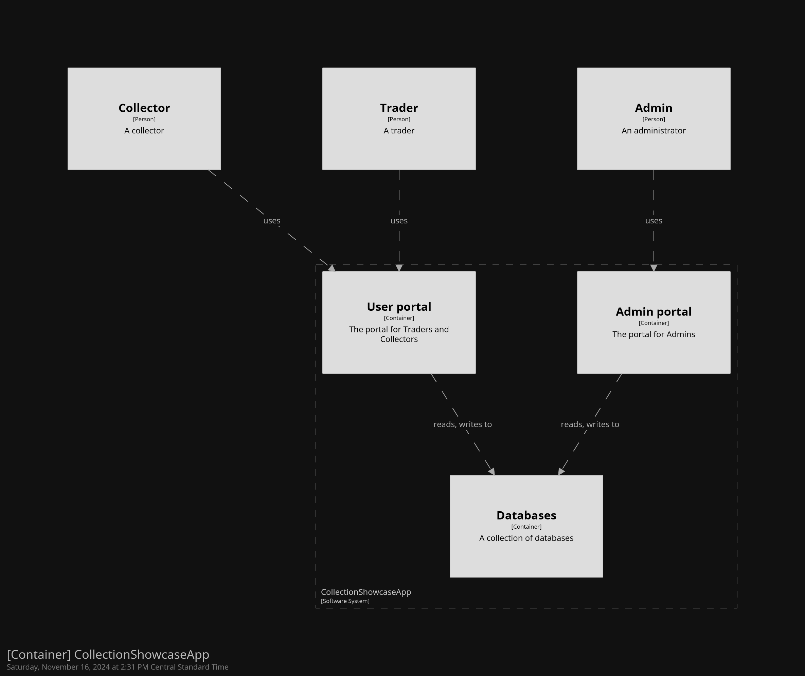

# Further Documentation
## User Stories
<!-- As a **user/role**, I want to **goal** so I can **rationale** -->
- As a **collector**, I want to **catalog my collection** so I can **lookup items in said collection.**
    - Acceptance criteria: let the collector insert, modify, and view their personal collecion.

- As a **trader**, I want to **see collector's collections** so I can **view potential trade items**
    - Acceptance criteria: Have a "view collector" option showing other collectors on the system.

- As an **administrator**, I want to **manage the application** so I can **improve the application for my users.**
    - Acceptance criteria: Create a superuser account.

## Mis-User Stories
<!-- In addition to the user stories identify the ways in which users might be able to mis-use your app. Mis-user stories are just like user stories except the user, goal, and rationale are malicious. -->
- As a **rival collector**, I want to **impersonate another collector** so I can **modify and/or delete items in said collector's collection.**
    - Mitigation Criteria: ensure proper authentication is in place.
- As a **clumsy collector**, I want to remove **an item** so I can **be clumsy.**
    - Mitigation Criteria: add a verification prompt to ensure they want to remove an item from their collection.

# Diagrams
## Mockup

## C4 Architecture
### Context

### Container

### Components

[To Home](../README.md)